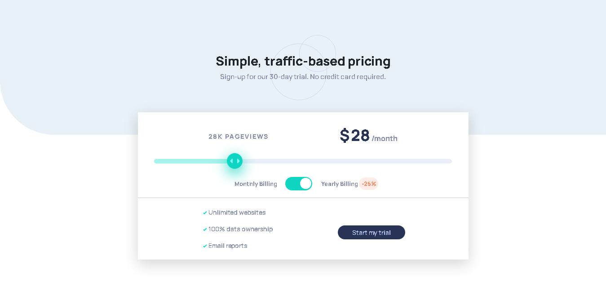
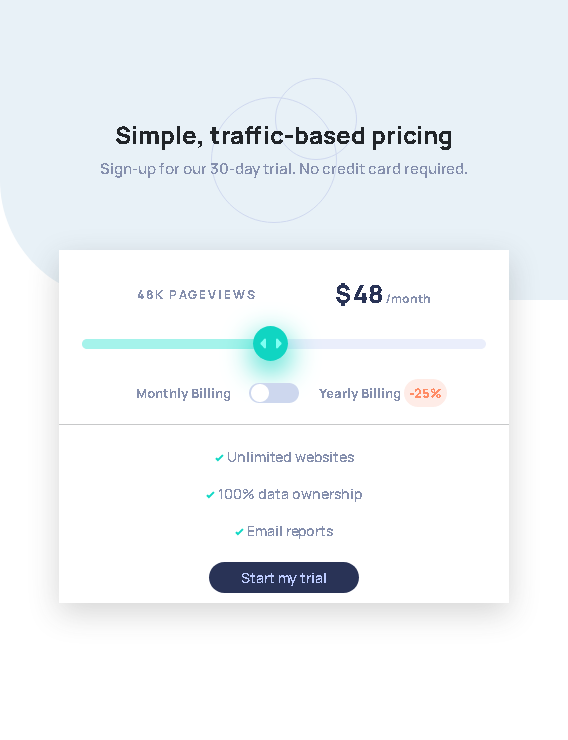

<h1 align="center">
 Desafio FrontendMentor - INTERACTIVE PRICING
</h1>

<a href="https://www.frontendmentor.io">frontendmentor</a> projeto feito para fins de estudo

## Participantes

[Sammynauta](https://github.com/Sammynauta)

## Recursos

- [x] HTML, CSS, JS
- [x] BOOTSTRAP
- [x] SVG Images

## Sobre o Desafio

Neste projeto, o objetivo foi criar um componente de precificação interativo completo com controle deslizante de entrada de faixa personalizado e alternador de precificação.E torná-lo o mais parecido possível com o design original.

Os usuários devem ser capazes de:

     - Visualize o layout ideal para o aplicativo, dependendo do tamanho da tela do dispositivo
     Veja os estados de foco para todos os elementos interativos na página.

     - Use o controle deslizante e alterne para ver os preços para os diferentes números de visualização de página.

